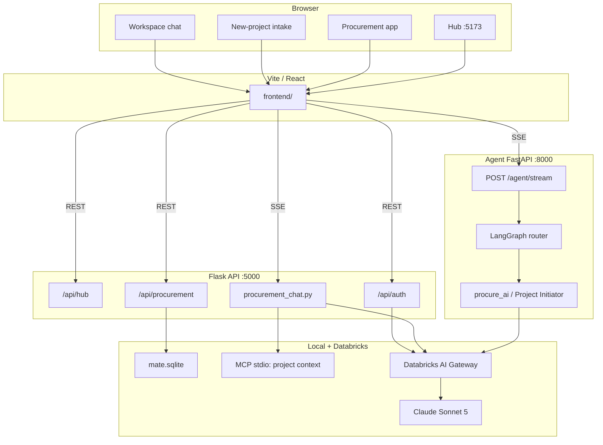

# Mate

Etex internal AI accelerator. A hub-and-spoke platform: each vertical (Procurement, Document Builder, …) is a React app backed by a shared Flask API and a LangGraph agent stack on Databricks.

**Repo:** [https://github.com/HarshithRL/ETEX.git](https://github.com/HarshithRL/ETEX.git)

---

## Final goal

The **Hub** is the home page. From there, specialists open vertical tools.

The first vertical is the **Procurement Agent**.

**Business use case — vendor comparison:** the user uploads vendor / RFP documents; Mate produces a comparison matrix, a PPT, and a project workspace with an AI assistant.

Target stack for that product: React + Flask + LangChain / LangGraph + Deep Agents + Databricks + MLflow + FastAPI (agent wrapper). Deploy target is **Databricks Apps** (Linux, Python 3.11).

## Present focus

Procurement is the only built vertical. Hub, dashboard, projects, intake chat, and workspace chat are live. Vendor comparison, PPT, file upload, real persistence, and Databricks Apps deploy are not started yet.

| Capability | Status |
|------------|--------|
| Hub page | Done |
| Procurement dashboard / projects | Mock data |
| New-project intake chat (SSE) | Working |
| Workspace chat (SSE + MCP prefetch) | Working |
| FastAPI agent wrapper `:8000` | Working |
| Document parser CLI | Built, not wired to the API |
| File upload | Not started |
| Vendor comparison matrix | Not started — core use case |
| PPT generation | Not started |
| MLflow tracing | Not started |
| Deep agents | Not started |
| Database / Lakebase | Not started (local sqlite seed + static payloads) |
| Databricks Apps deploy | Not started |

Handbook with gaps and conventions: [`agent.md`](agent.md).

---

## Architecture



**Request paths**

- Hub → `GET /api/hub` → tool cards.
- Procurement dashboard → `GET /api/procurement/dashboard` (mock KPIs).
- New project chat → Vite → `POST http://127.0.0.1:8000/agent/stream` (`route=new_project`) → LangGraph → Project Initiator.
- Workspace chat → Vite → Flask `.../workspace/chat/stream` → MCP prefetch into the system prompt → `create_agent` (tools not bound; Gateway currently rejects `tool_result` round-trips).
- Auth → `GET /api/auth` → Databricks `WorkspaceClient` (local CLI profile, or app SP + OBO on Databricks Apps).

```
ai_application/
├── frontend/          React hub + procurement vertical (Vite :5173)
├── backend/           Flask API (run from this folder → :5000)
├── agent_server/      LangGraph + FastAPI SSE wrapper (:8000) + parser CLI
├── shared/            logging, sqlite, artifact parsers
├── start-dev.ps1      opens the three local servers
└── requirements.txt   Python deps (hand-maintained; do not uv-compile on Windows)
```

---

## Tech stack

| Layer | Tech | Local URL |
|-------|------|-----------|
| Frontend | React 19, Vite 8, React Router 7, GSAP, shadcn/ui (Nova) | http://localhost:5173 |
| API | Flask 3, flask-cors | http://127.0.0.1:5000 |
| Agent | LangChain `create_agent`, LangGraph, FastAPI + SSE | http://127.0.0.1:8000 |
| LLM | `ChatDatabricks` via AI Gateway | `system.ai.claude-sonnet-5` |
| Identity | Databricks SDK `WorkspaceClient` | profile `adb-7181820732839861` |
| Data (now) | SQLite (`mate.sqlite`) + mock payloads | gitignored |
| Observability (planned) | MLflow tracing | — |
| Deploy (planned) | Databricks Apps | Ubuntu 22.04 / Python 3.11 |

---

## Clone

```powershell
git clone https://github.com/HarshithRL/ETEX.git
cd ETEX
```

Needs **Git**, **Python 3.11**, **Node.js 20+**, **npm**, and the **Databricks CLI** logged into the Etex workspace.

---

## What to set in the shell (env)

The app reads **process environment variables**, not a `.env` file. Set them in PowerShell before starting servers (or use `.\start-dev.ps1`, which sets the Databricks profile for you).

Copy [`.env.example`](.env.example) as a checklist. Do not commit a real `.env`.

### Required for chat / identity

Authenticate the Databricks CLI once, then point Mate at that profile:

```powershell
databricks auth login --profile adb-7181820732839861
$env:DATABRICKS_CONFIG_PROFILE = "adb-7181820732839861"
```

Profile host: `https://adb-7181820732839861.1.azuredatabricks.net`. Tokens live in `~/.databrickscfg`, not in this repo.

| Variable | Typical local value | Purpose |
|----------|---------------------|---------|
| `DATABRICKS_CONFIG_PROFILE` | `adb-7181820732839861` | CLI profile for `WorkspaceClient` / ChatDatabricks |

### Optional overrides

| Variable | Default | Purpose |
|----------|---------|---------|
| `DATABRICKS_MODEL` | `system.ai.claude-sonnet-5` | Gateway model name |
| `DATABRICKS_MAX_TOKENS` | `1024` | LLM max tokens |
| `DATABRICKS_TEMPERATURE` | unset | Optional sampling temperature |
| `DATABRICKS_HOST` | from profile | Workspace host fallback |
| `FLASK_SECRET_KEY` | `mate-dev-insecure-secret` | Flask session cookie (change for any shared deploy) |
| `MATE_ENV` | `dev` | `prod` tightens logging / hides reasoning |
| `MATE_LOG_LEVEL` | `DEBUG` | Minimum log level |
| `MATE_LOG_FORMAT` | `pretty` | `pretty` or `json` |
| `MATE_LOG_DIR` | `logs/` | Rotating log files (gitignored) |
| `MATE_STDLIB_LOG_LEVEL` | `WARNING` | uvicorn / langchain / httpx |
| `MATE_SQLITE_PATH` | `mate.sqlite` | Local database path |
| `MATE_PROJECTS_DATA_ROOT` | (repo default) | Project files root |
| `MATE_SHOW_REASONING` | off unless `MATE_ENV` ≠ `prod` | Stream model thought blocks |

Set on **Databricks Apps** by the platform (do not put secrets in git):

| Variable | Purpose |
|----------|---------|
| `DATABRICKS_APP_NAME` | Marks app runtime (secure cookies, SP identity) |
| `DATABRICKS_CLIENT_ID` / `DATABRICKS_CLIENT_SECRET` | Service principal when running as an app |

Frontend has no Vite env vars; it calls `http://<hostname>:5000` and `:8000` directly.

Example session:

```powershell
$env:DATABRICKS_CONFIG_PROFILE = "adb-7181820732839861"
$env:MATE_ENV = "dev"
$env:MATE_LOG_LEVEL = "DEBUG"
$env:FLASK_SECRET_KEY = "change-me-locally"
```

---

## Install and run

```powershell
# Python
python -m venv .venv
.\.venv\Scripts\Activate.ps1
pip install -r requirements.txt

# Frontend
cd frontend
npm install
cd ..

# All three processes (Flask :5000, Vite :5173, Agent :8000)
.\start-dev.ps1
```

Stop them:

```powershell
.\stop-dev.ps1
```

Or start by hand:

```powershell
# Terminal 1 — from backend/
cd backend
python app.py

# Terminal 2
cd frontend
npm run dev

# Terminal 3 — from repo root
$env:PYTHONPATH = (Get-Location).Path
python -m agent_server.start_server
```

Open **http://localhost:5173**.

`requirements.txt` is hand-maintained. Do not run `uv pip compile` on Windows — it pins `pywin32` and breaks the Linux Apps build.

---

## Useful checks

```powershell
python -m agent_server.graph                          # agent graph smoke test
python -m agent_server.file_handler.parser <file> --out ./parsed/
```

---

## License

Internal Etex use.
